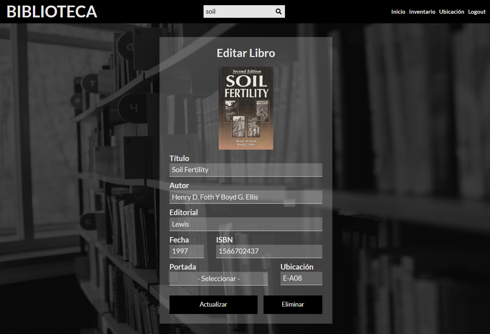

# BIBLIOTECA Frontend


## Overview

The **BIBLIOTECA** frontend is a comprehensive web application that allows users to manage a collection of books efficiently. Developed using React, TypeScript, and Tailwind CSS, the application offers features such as searching, inventory management, and viewing book details, including managing their locations within the library, along with a user-friendly interface.

## Features

The **BIBLIOTECA** frontend offers several features designed to make book management simple and effective:

- **User Authentication**: Secure login system allowing users to access and manage the inventory.
- **Inventory Management**: View, add, edit, and delete books in the library's collection.
- **Book Search**: Search for books by keywords and view detailed information about each book.
- **Book Details View**: Display detailed information about each book, including its location in the library.
- **Responsive Design**: Fully responsive design ensuring a seamless experience across different devices.

## Screenshots

Here are some screenshots of the **BIBLIOTECA** frontend:

### Home Screen


### Search View


### Book Details View


### Edit Book



## Technologies Used

- **React**: A JavaScript library for building user interfaces.
- **TypeScript**: A typed superset of JavaScript that compiles to plain JavaScript.
- **Tailwind CSS**: A utility-first CSS framework for rapid UI development.
- **Vite**: A fast build tool and development server.
- **React Router DOM**: Declarative routing for React.js applications.
- **React Hook Form**: A library for managing form state and validation.
- **Axios**: A promise-based HTTP client for making requests to the backend.
- **SweetAlert2**: A library for creating beautiful, responsive, and customizable alerts.
- **Zod**: A TypeScript-first schema declaration and validation library.
- **React Query**: A library for managing server state and data fetching in React applications.

## API Integration

The **BIBLIOTECA** frontend relies on an external API for fetching data and handling user interactions. The API is essential for the proper functioning of the application.

### API Repository

The API for the **BIBLIOTECA** is located in a separate repository. You can find it here:

- [Biblioteca API Repository (Express)](https://github.com/william-medina/biblioteca-backend-express) - This repository contains the Express API.
- [Biblioteca API Repository (Laravel)](https://github.com/william-medina/biblioteca-backend-laravel) - This repository contains the Laravel API.
- [Biblioteca API Repository (Spring Boot)](https://github.com/william-medina/biblioteca-backend-springboot) - This repository contains the Spring Boot API.

### API Configuration

The frontend application communicates with the backend API through an environment variable. Ensure the base URL of the API is correctly set to include the `/api` path.

- **Frontend Environment Variable**: `VITE_API_URL`

  - The value of `VITE_API_URL` should be set to the base URL of the API with the `/api` endpoint, for example: `http://localhost:4000/api`.

Ensure that this variable points to the correct API endpoint.

## Getting Started

To get started with the **BIBLIOTECA** frontend, follow these steps:

### Prerequisites

- [Node.js](https://nodejs.org/) (Recommended to use the latest LTS version for best stability)
- [NPM](https://www.npmjs.com/) (Node Package Manager)

### Installation

1. Clone the repository:

    ```bash
    git clone https://github.com/william-medina/biblioteca-frontend-react.git
    ```

2. Navigate to the project directory:

    ```bash
    cd biblioteca-frontend-react
    ```

3. Install the dependencies:

    ```bash
    npm install
    ```

4. Set up environment variables:

    Create a `.env.local` file in the root of your project directory and add the following line:

    ```env
    VITE_API_URL=http://localhost:4000/api
    ```

    This file is used to configure environment-specific settings, such as the API URL.

### Development

To start the development server, use the following command:

```bash
npm run dev
```

### Building

To build the application for production, follow these steps:

1. **Run the Build Command**

    Execute the following command to compile the TypeScript code and bundle the application for production:

    ```bash
    npm run build
    ```

    This command will:

    - Compile TypeScript files into JavaScript.
    - Bundle all assets and dependencies using Vite.
    - Output the production-ready files into the `dist` directory.

2. **Deploy the Build**

    Once the build process is complete, you can deploy the contents of the `dist` directory to your production server. The `dist` directory will contain all the necessary files to serve the application.

3. **Verify the Build**

    To ensure everything is working correctly, you can use the preview command to locally test the production build before deploying:

    ```bash
    npm run preview
    ```

    This will serve the production build and allow you to verify that the application behaves as expected.

By following these steps, you will generate a production-ready version of the Flags Quiz frontend application.

## Production URL

You can access the **BIBLIOTECA** frontend application at the following URL:

- [Flags Quiz Application](https://biblioteca.william-medina.com)

This link will take you to the live version of the application where you can explore its features and gameplay.

## Author

This frontend application for **BIBLIOTECA** is developed and maintained by:

**William Medina**

Thank you for checking out **BIBLIOTECA**!