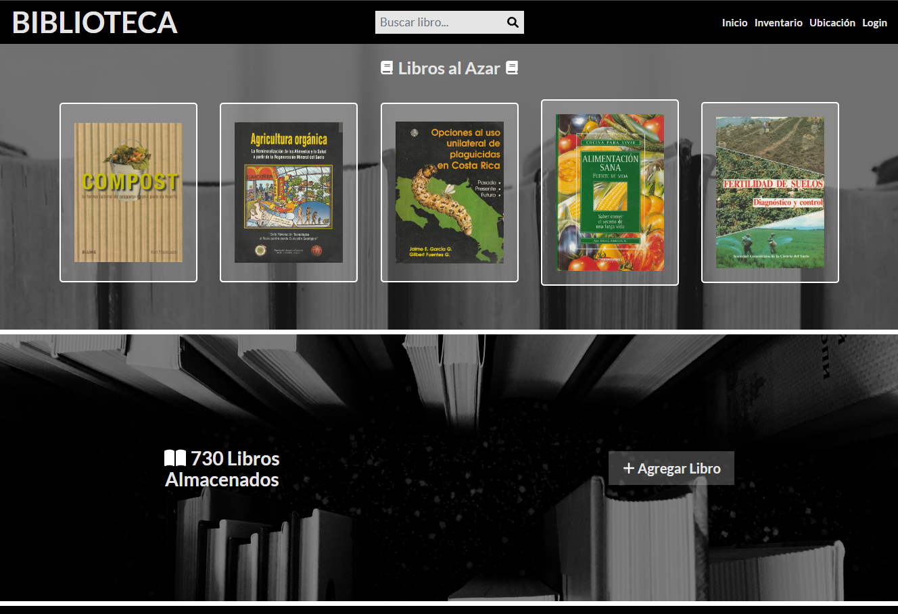
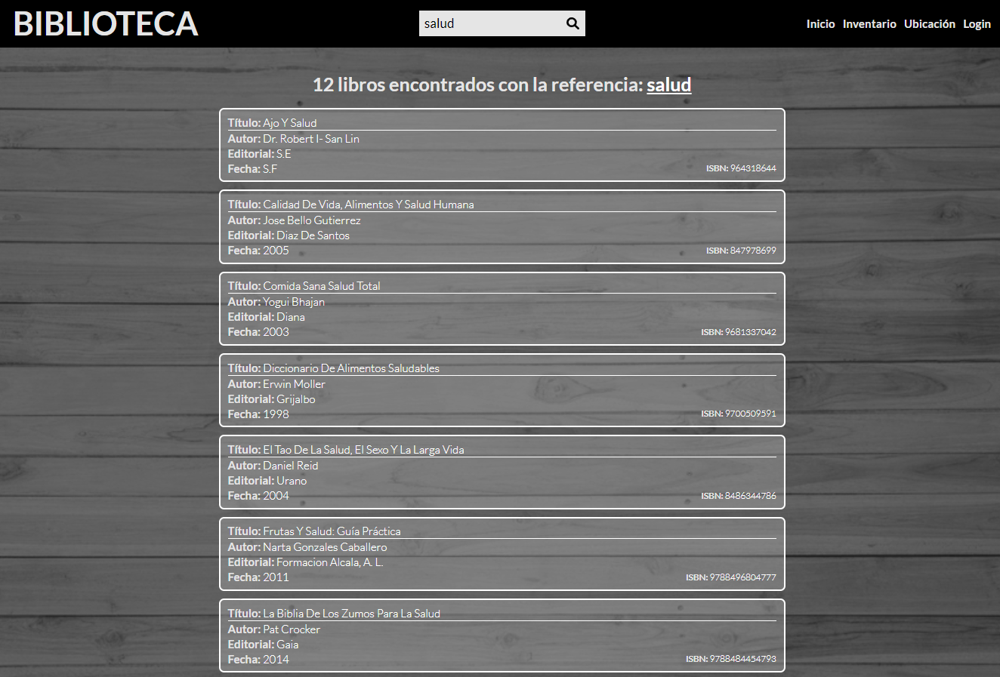
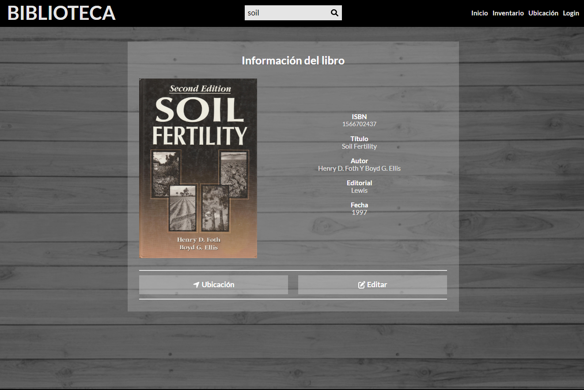
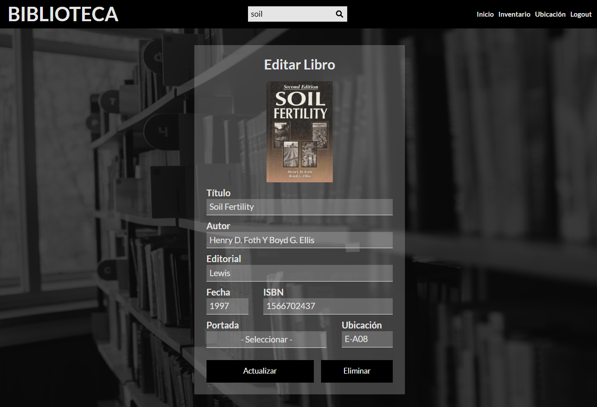

# BIBLIOTECA Frontend

## Descripción

El frontend de **BIBLIOTECA** es una aplicación web integral que permite a los usuarios gestionar una colección de libros de manera eficiente. Desarrollada utilizando React, TypeScript y Tailwind CSS, la aplicación ofrece funciones como búsqueda, gestión de inventario y visualización de detalles de los libros, incluyendo la gestión de su ubicación dentro de la biblioteca, junto con una interfaz amigable para el usuario.

## Características

El frontend de **BIBLIOTECA** ofrece varias características diseñadas para hacer la gestión de libros simple y efectiva:

- **Autenticación de Usuario**: Sistema de inicio de sesión seguro que permite a los usuarios acceder y gestionar el inventario.
- **Gestión de Inventario**: Ver, agregar, editar y eliminar libros en la colección de la biblioteca.
- **Búsqueda de Libros**: Buscar libros por palabras clave y ver información detallada sobre cada libro.
- **Visualización de Detalles del Libro**: Mostrar información detallada sobre cada libro, incluyendo su ubicación en la biblioteca.
- **Diseño Responsivo**: Diseño completamente responsivo que garantiza una experiencia fluida en diferentes dispositivos.

## Capturas de Pantalla

Aquí hay algunas capturas de pantalla del frontend de **BIBLIOTECA**:

### Pantalla de Inicio


### Vista de Búsqueda


### Visualización de Detalles del Libro


### Editar Libro



## Tecnologías Utilizadas

- **React**: Una biblioteca de JavaScript para construir interfaces de usuario.
- **TypeScript**: Un superconjunto tipado de JavaScript que se compila a JavaScript puro.
- **Tailwind CSS**: Un framework CSS basado en utilidades para el desarrollo rápido de interfaces.
- **Vite**: Una herramienta de construcción rápida y un servidor de desarrollo.
- **React Router DOM**: Enrutamiento declarativo para aplicaciones React.js.
- **React Hook Form**: Una biblioteca para gestionar el estado y la validación de formularios.
- **Axios**: Un cliente HTTP basado en promesas para hacer solicitudes al backend.
- **SweetAlert2**: Una biblioteca para crear alertas hermosas, responsivas y personalizables.
- **Zod**: Una biblioteca de declaración y validación de esquemas centrada en TypeScript.
- **React Query**: Una biblioteca para gestionar el estado del servidor y la obtención de datos en aplicaciones React.

## Integración con la API

El frontend de **BIBLIOTECA** depende de una API externa para obtener datos y manejar las interacciones del usuario. La API es esencial para el correcto funcionamiento de la aplicación.

### Configuración de la API

La aplicación frontend se comunica con la API del backend a través de una variable de entorno. Asegúrate de que la URL base de la API esté configurada correctamente para incluir la ruta `/api`.

- **Variable de Entorno del Frontend**: `VITE_API_URL`

  - El valor de `VITE_API_URL` debe configurarse con la URL base de la API con el endpoint `/api`, por ejemplo: `http://localhost:4000/api`.

Asegúrate de que esta variable apunte al endpoint correcto de la API.

## Empezando

Para comenzar con el frontend de **BIBLIOTECA**, sigue estos pasos:

### Requisitos Previos

- [Node.js](https://nodejs.org/) (Se recomienda usar la última versión LTS para mayor estabilidad)
- [NPM](https://www.npmjs.com/) (Node Package Manager)

### Instalación

1. Clona el repositorio:

    ```bash
    git clone https://github.com/william-medina/biblioteca-frontend-react.git
    ```

2. Navega al directorio del proyecto:

    ```bash
    cd biblioteca-frontend-react
    ```

3. Instala las dependencias:

    ```bash
    npm install
    ```

4. Configura las variables de entorno:

    Crea un archivo `.env.local` en la raíz de tu directorio del proyecto y añade la siguiente línea:

    ```env
    VITE_API_URL=http://localhost:4000/api
    ```

    Este archivo se usa para configurar ajustes específicos del entorno, como la URL de la API.

### Desarrollo

Para iniciar el servidor de desarrollo, usa el siguiente comando:

```bash
npm run dev
```

### Construcción

Para construir la aplicación para producción, sigue estos pasos:

1. **Ejecuta el Comando de Construcción**

    Ejecuta el siguiente comando para compilar el código TypeScript y empaquetar la aplicación para producción:

    ```bash
    npm run build
    ```

    Este comando hará lo siguiente:

    - Compilará los archivos TypeScript en JavaScript.
    - Empaquetará todos los activos y dependencias usando Vite.
    - Generará los archivos listos para producción en el directorio `dist`.

2. **Despliega la Construcción**

    Una vez que el proceso de construcción esté completo, puedes desplegar el contenido del directorio `dist` en tu servidor de producción. El directorio `dist` contendrá todos los archivos necesarios para servir la aplicación.

3. **Verifica la Construcción**

    Para asegurarte de que todo funcione correctamente, puedes usar el comando de vista previa para probar localmente la construcción de producción antes de desplegar:

    ```bash
    npm run preview
    ```

    Esto servirá la construcción de producción y te permitirá verificar que la aplicación se comporte como se espera.

Siguiendo estos pasos, generarás una versión lista para producción del frontend de **BIBLIOTECA**.

## URL de Producción

Puedes acceder a la aplicación frontend de **BIBLIOTECA** en la siguiente URL:

- [Aplicación BIBLIOTECA](https://biblioteca.william-medina.com)

Este enlace te llevará a la versión en vivo de la aplicación donde podrás explorar sus características y funcionamiento.

## Autor

Esta aplicación frontend para **BIBLIOTECA** es desarrollada y mantenida por:

**William Medina**

¡Gracias por revisar **BIBLIOTECA**!